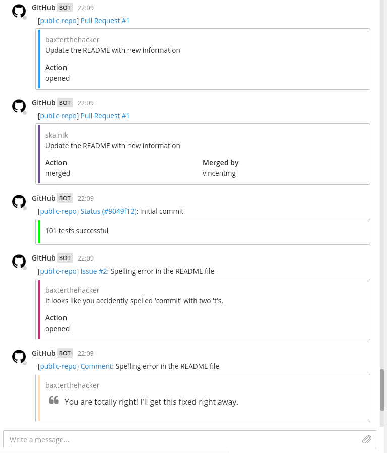

# ghmm

[](https://travis-ci.org/UlfS/ghmm)
[](https://hub.docker.com/r/ulfs/ghmm)

GitHub integration for Mattermost.

## Description

A server listening for GitHub events via webhooks.
These events are relayed to Mattermost after processing and formatting.



## Supported Events

- [PushEvent](https://developer.github.com/v3/activity/events/types/#pushevent)
- [PullRequestEvent](https://developer.github.com/v3/activity/events/types/#pullrequestevent)
- [PullRequestReviewEvent](https://developer.github.com/v3/activity/events/types/#pullrequestreviewevent)
- [PullRequestReviewCommentEvent](https://developer.github.com/v3/activity/events/types/#pullrequestreviewcommentevent)
- [IssuesEvent](https://developer.github.com/v3/activity/events/types/#issuesevent)
- [IssueCommentEvent](https://developer.github.com/v3/activity/events/types/#issuecommentevent)
- [StatusEvent](https://developer.github.com/v3/activity/events/types/#statusevent)

Feel free to open a pull request or an issue if you need support for an event.

# Setup

To set this up you will need to do three steps:

1. create a Mattermost incoming webhooks
2. deploy ghmm somewhere publicly accessible
3. add GitHub webhooks


You have several options for deploying ghmm:

- deploy using the Docker image
- deploy on Heroku
- build and deploy yourself

## 1. Create a Mattermost Incoming Webhook

The [Mattermost documentation](https://docs.mattermost.com/developer/webhooks-incoming.html)
explains how to set this up.

You will get an address which looks similar to this one:
> http://mattermost.hostname.com/hooks/xxx-generatedkey-xxx


## 2. Deploy ghmm

### 2.1 Create an Environment

You need to set some environment variables to start ghmm.
Most of them are self-explanatory.

| Variable             | Description
| -------------------- | ----------------------------------------------------- |
| `MATTERMOST_URL`     | URL where Mattermost is available                     |
| `MATTERMOST_API_KEY` | Value at the end of the incoming webhook url          |
| `MATTERMOST_CHANNEL` | Channel to post the messages to (optional)            |
| `GITHUB_SECRET`      | Secret you share between GitHub and ghmm (optional)   |
| `PORT`               | Port to start ghmm on (default: `8000`)               |
| `LOG_LEVEL`          | Log level (default: `ERROR`)\*                        |

See `config/dev.example` for how this might look like.

Note that this example configuration also includes values for the development scripts, which might not be relevant for you.

\* Accepted values:
`DEBUG`, `INFO`, `NOTICE`, `WARNING`, `ERROR`, `CRITICAL`, `ALERT`, `EMERGENCY`


### 2.2a Deploy using the Docker

The latest Docker image [UlfS/ghmm](https://hub.docker.com/ulfs/ghmm/) is available on Docker Hub.

You can easily run the app with the included docker-compose configuration.

```sh
. config/dev              # loads the configuration / environment variables
docker-compose up -d app  # starts the app
```

*Note*: You can also build the Docker image yourself using stack.
```sh
stack image container     # creates a docker image 'ulfs/ghmm'
```

### 2.2b Deploy on Heroku

You need an Heroku account and have the [Heroku CLI](https://devcenter.heroku.com/articles/heroku-cli) installed.

#### Create the app

Create an app using mfine's buildpack for haskell.

```sh
heroku create --buildpack https://github.com/UlfS/heroku-buildpack-stack.git your-app-name
git push heroku master
```

#### Configure the environment

You need to set the environment mentioned in section 2.1 on Heroku:

```sh
heroku config:set MATTERMOST_URL=your.mattermost.server.com
heroku config:set MATTERMOST_API_KEY=your-mattermost-api-key-here
```
*Note*: `PORT` does not need to be set - it will be set by Heroku.

#### Create a web dyno

To deploy the app you need at least one web dyno.

```sh
heroku scale web=1
```

The app is now available at https://your-app-name.herokuapp.com/.


### 2.2c Build and deploy using [stack](https://www.haskellstack.org/)

Stack automatically downloads GHC and builds the project.

Follow the [instructions](https://docs.haskellstack.org/en/stable/README/#how-to-install)
to install it.

#### Build the Project

`stack build`

The output will also tell you where to find the executable.

*Note*: Building can also be done in a Docker container, see [stack's docker integration usage](https://docs.haskellstack.org/en/stable/docker_integration/).

#### Start the app

You can start the app directly or create a docker container for it and run that.

##### a) Run natively

```sh
. config/dev            # loads the configuration / environment variables
stack exec ghmm-exe     # starts the app on the configured port
```

##### b) Run as Docker container

If you want to run the app as a docker container, you can build an image using `stack` and run the app with the included docker-compose configuration.

```
stack image container     # creates a docker image 'ulfs/ghmm'
. config/dev              # loads the configuration
docker-compose up -d app  # starts the app on port 8000
```

*Note*: There is also a [Docker image (UlfS/ghmm)](https://hub.docker.com/ulfs/ghmm/) with the latest code on Docker Hub.


### *Note*: Local Deployment / Development

If you want to deploy or test it locally, you can use tunneling services such as
[beame-insta-ssl](https://github.com/beameio/beame-insta-ssl), [ngrok](https://ngrok.com/),
[pagekite](https://pagekite.net/) or [localtunnel](https://localtunnel.me).

*Note*:
I personally use [beame-insta-ssl](https://github.com/beameio/beame-insta-ssl),
because it works great within different networks and they provide a static
address for free. Otherwise you have to delete and add the new address to your
GitHub repo(s) every time you restart the process.


## 3. Add GitHub Webhooks

There is a [page on Github](https://developer.github.com/webhooks/creating/)
which explains how to do that.

The `config.url` must point to where ghmm is available.
Make sure it is publicly accessible.

The `config.content_type` must be `application/json`.

*Optional*: Choose a `config.secret` that is shared between GitHub and ghmm, so that
strangers can't impersonate GitHub.
